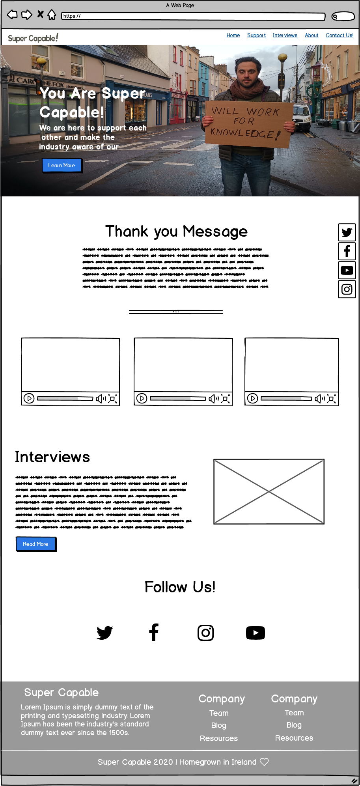
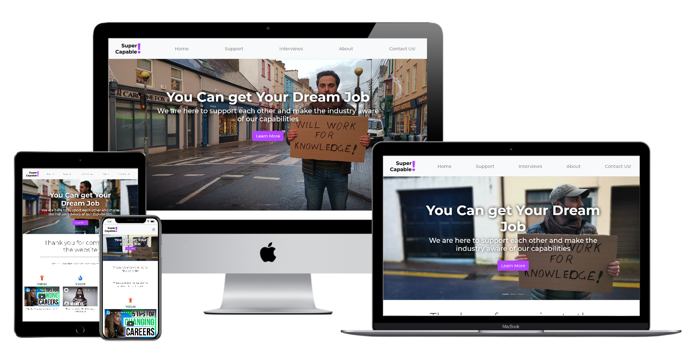

</img> 

# Super Capable

## Site Overview - The Story

There comes a time when you feel like your job is a bit stagnant, not being able to progress, doing the same thing day in day out. You professional life is boring, you need a change. 

But how can you when you are, what many might consider, too old to change your career! 

This website is built for the overlooked minorities who are also majority of the working population. The over 40s that want to career change. The website will have curated articles, advice, and support for that ones who need it.

## UX

Use this section to provide insight into your UX process, focusing on who this website is for, what it is that they want to achieve and how your project is the best way to help them achieve these things.

The idea to take advantage of the "Lazy coder" approach and use pre-coded core bootstrap template, snippets and libraries where possible. They will be then redesigned to fit my visual and CX (Customer Experience) requirements.

Although the project only requires HTML & CSS, I wanted to challenge myself and use bootstrap to learn how to code with it. 

Once the visitor lands on the page they are greeted with a jumbotron image and a H1 text catching their attention for what the website is all about. 

The Navbar will have tabs connected to three sections. 'About', 'Interviews', 'Resources', and 'connect with us' tab to a new page. 

The website will have 5 pages & sections that will include the following:

	• Home: The main page of the website.
	• Support: A curated resources of the information that to support the SC initiative.
	• Interviews: Interviews with people who already faced and overcame the challanges many visiting the website are currently going through. 
    • About: Who we are, what we do and why.
	• Connect: The contact us section of the Home page.
	• Social Media Section: logos to our social media links.

## Wireframe

As a recommendation for wireframing I got to use [Balsamiq] (https://balsamiq.com/) that helped me with better visualise the main structure of the website for different devices.

### Desktop

</img> 

### Tablet

</img> 

### Mobile

</img> 

## Footer

You probably heard this many times through a friend or personally that you are too late to change. You will not learn new things, will never accept told off by others lot younger than you. I know I have been there many time, yet it didn't stop me. It made me more determined to prove others wrong. 

In particular, as part of this section we recommend that you provide a list of User Stories, with the following general structure: As a user type, I want to perform an action, so that I can achieve a goal.
This section is also where you would share links to any wireframes, mockups, diagrams etc. that you created as part of the design process. These files should themselves either be included as a pdf file in the project itself (in an separate directory), or just hosted elsewhere online and can be in any format that is viewable inside the browser.

## Features

The Carousel Slider:

Sliding images to provide the visitor with impactful images and catch phrases. This is to prompt them to scroll and decrease the bounce rate of the visitors.

### Welcome

A brief introduction and further explanation to what the website is all about.

### Support

Videos that provide the visitor with valuable relevant information to help them with their career changes.

### Interviews

The most powerful part of the website as it will showcase real life story of people who successfully changed careers. The main purpose of this section is to motivate and comfort the person who is, in many cases, panicing about their career povit.

### About

A bit of an introduction of the people behind the project and how they can connect with us.

### Contect Us Page

Created a page that allows the visitors to contact us through email and messaging by filling out a customised form.

## Future Features

### Blog Section

In time there will be more contributors to the website with blog posts. They will cover persoanl experiences, guidlines, reviews of pbest practices and important annoucements.

### Podcast

A podcast focusing on the career opportunities, interviewing successful career pivoters and corporations on how they see career shifting fits their businesses.

### Misc

* Darken Carousel images to make the titles more visible.
* Add "back to top" scroll up button for faster scroller function.

## Technologies Used

* Bootstrap:(https://getbootstrap.com/) - I used bootstrap 4 for to challenge myself and learn how to use it better.
* Gitpod: (https://gitpod.io/) the IDE for coding and edit the website. It has a great commit ability as well.
* Font Awesome:(https://fontawesome.com/) - Used for the scial media icons and for the Support section.
* GitHub: (https://github.com/) I wanted to have a centralised repository location and it is the most popular.
* Google Fonts:(https://fonts.google.com/) I used Montserrat fonts and San Serif as back up.
* HTML & CSS: Used to design the website and styling.

## Testing

I frequently used the Chrome developer tools to test the website. It also helped me with finding where the UX faults are.

Another tool I used at the end of the project was Unicorn Revealer. Great to pinpoint any overflows. 

Other tools to validate the HTML & CSS were: 

* https://jigsaw.w3.org/css-validator/
* https://validator.w3.org/

Note about the code formatting: It was mentioned to me by my mentor that the code wasn't as well formatted as desired. I went to the auto formatting fuction provided by Gitpod (Alt+Sift+F). 

### challenges

The below points are some testing stories that I faced and testing challange I went through. They are in particular order:

#### Carousel slider

* The first challenge I faced with the slider to get the images fit the real estate view. I was able to succeed when I researched online, where I found the answer to be adding the width & hight at 100%. 
* The other challenge was to go the slider working. I reseached online and found the solution here (https://www.w3schools.com/bootstrap4/bootstrap_carousel.asp). It helped me with getting the slider to work.

#### Video

* I had to learn how to embed the youtube videos since direct embed link from YouTube wasn't working. I realised that I had to replace the shortform url in the embedded script with the full link of the video. Plus had to keep this extra code for it to work (?rel=0)

#### Navigation links

* Been struggling with linking the naviagtions with the right sections. Through research I found out how to link index.html to "Home" and "Contact Us" to contact.html. Also also learned to how link sections on the same page, but main page sections from another page. 

For example, "Support" on navbar didn't work from contact.html. 

* A challenge I faced with was the appearing logo. I make the mistake of not adding "assets" to the code where the image didn't show. img src="assets/images/logo.png"

* The other challenge I had to go through was the logo design. 

* Been trying to add the fontawesome icons with no luck where I then realised that I didn't add the script source into HTML.

* Using the inspector tool I was able to test the website's adaptability to the different browsers and screen sizes. The screen sizes are done in the Style.css sheet. Here's a mockup example of how it will look like on multiple screens:

</img> 

## Deployment

All the coding is doing from Gitpod. I forked the CI template into Github and then ported it to Gitpod using the recommeded mothod. The code was run on Gitpod, constantly committed with updates, and then pushed to Github.

## Credits

### Resources:

Bootstrap 4 core download : https://getbootstrap.com/

Barebone website template & boiler plate that (I also updated with the latest versions) from: https://m.w3newbie.com/d/tutorial-29.zip (Template Code can been seen at Initial Commit2, 13a42f9945d74651cb264b44e636df9b934ca81c)

Base repository forked from Code Institute: https://github.com/Code-Institute-Org/gitpod-full-template

### Content:

All the content is written by me and the rest are ipsum auto generated on https://loremipsum.io/

### Media:

The photos were taken by myself and resized for better website performance using this website

Background: Rick Nassar
Logo: Designed in Google Draw by Rick Nassar
		
## Acknowledgements

I received learnings & tutorials on how to build the bootstrap website from YouTube channels like Responsive Bootstrap Website Start To Finish with Bootstrap 4, HTML5 & CSS3. Also from websites like the following:

* https://css-tricks.com/
* https://www.w3schools.com/bootstrap4
* https://websitesetup.org/
* https://getbootstrap.com/docs/4.4/getting-started/introduction/
* https://developer.mozilla.org/en-US/docs/Learn/HTML

I also received valuable guidance from my mentor Rohit Sharma who advised me on how to be a better programmer.

### References

README reference was from this readme file: https://github.com/D0nni387/Luxury-Door-Solutions/blob/master/README.md
	
	
